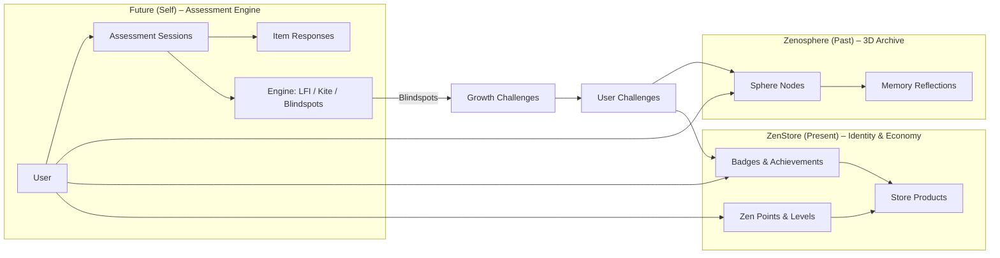

# Zenotika 3.0 – Backend Architecture Blueprint (Target State)
Status: APPROVED BLUEPRINT (Pending Implementation)
Baseline Context: `kolb/backend` (v2.0) -> Target: Zenotika v3.0

> **CRITICAL NOTE:** This document describes the **TARGET** architecture. Features marked with [*] requires immediate DB Migrations & Logic Implementation on top of the existing `kolb-backend` codebase.

> Goal: This document is the **single source of truth (SSOT)** for Zenotika’s backend architecture, aligned with the existing `kolb` backend. It covers concepts, folder structure, contracts, and key flows in ~500 lines.

---

## 1. System Overview

### 1.1 Vision

Zenotika is an **ecosystem for human growth & nation building**, not just a psychometric test.

Core ideas:

- Users are **dynamic**; we persist **vectors and histories**, not static types.
- Assessments exist to surface **blindspots** and then prescribe **Growth Challenges**.
- The system merges:
  - **Future (Self)** – psychometrics & learning style engine.
  - **Zenosphere (Past)** – 3D memory archive.
  - **ZenStore (Present)** – identity, badges, and economic contribution.

### 1.2 Tech & Constraints

- **Backend**: FastAPI, SQLAlchemy, Alembic.
- **DB**: PostgreSQL; JSONB where flexibility is needed.
- **Frontend**: SPA (client-side rendering), offline capable for assessments.
- **Baseline**: Must stay compatible with existing `kolb` backend layout and patterns.

---

## 2. High-Level Architecture

### 2.1 Layered Organization

- **Routers** (`app/routers`): HTTP endpoints. No business logic.
- **Schemas** (`app/schemas`): Pydantic request/response models.
- **Services** (`app/services`): Domain logic (scoring, blindspots, challenges, gamification).
- **Models** (`app/models`): SQLAlchemy ORM mappings.
- **Core** (`app/core`): cross-cutting concerns (config, security, logging).
- **DB** (`app/db`): database session and base declarations.
- **Domain Data** (`app/assessments`, `app/instruments`, `app/data`, `app/i18n`):
  - Psychometric keys, items, norms; not written at runtime.
- **Migrations** (`app/migrations`): Alembic scripts; all schema changes go here.

---

## 3. Trinity Architecture

Zenotika’s domain is decomposed as:

- **Future (Self)**  
  Assessment engine: sessions, responses, scoring, kite coordinates, blindspots.

- **Zenosphere (Past)**  
  3D spatial archive of experiences and reflections, tied to learning modes.

- **ZenStore (Present)**  
  Identity, badges, points, gated store products, and community fund.

### 3.1 Trinity Diagram (Mermaid)



---

## 4. Folder Layout (Backend)

```text
backend/
  app/
    main.py
    core/
      config.py
      security.py
      logging.py
      errors.py
    db/
      base.py
      session.py
    models/
      user.py
      assessment.py
      challenge.py
      sphere.py
      store.py
    schemas/
      auth.py
      user.py
      sessions.py
      results.py
      challenges.py
      sphere.py
      store.py
      telemetry.py
    services/
      auth_service.py
      user_service.py
      assessment_service.py
      engine.py
      challenge_service.py
      sphere_service.py
      store_service.py
      gamification_service.py
    routers/
      auth.py
      users.py
      sessions.py
      results.py
      challenges.py
      sphere.py
      store.py
      telemetry.py
      health.py
    assessments/
    instruments/
    data/
    i18n/
    migrations/
```

**Rules:**

- Routers only **coordinate** (validate + call services); never contain scoring or DB logic.
- Services may depend on:
  - Models, other services, and read-only domain config (from `assessments/`, `data/`).
- Models never import services or routers.

---

## 4.1 Required Migrations (The Gap)
To align the codebase with this SSOT, the following Engineering Tasks are mandatory:

1.  **Identity Upgrade:**
    * Add columns to `users`: `avatar_url`, `zen_points`, `current_lvl`, `life_motto`.
    * Create tables: `gamification_badges`, `user_achievements`.
2.  **Assessment Hardening:**
    * Create table: `assessment_item_responses` (Critical for Audit/Telemetry).
    * Create tables: `growth_challenges`, `user_challenges`.
3.  **Ecosystem Expansion:**
    * Create new modules: `app/models/sphere.py` & `app/models/store.py`.
4.  **Auth Update:**
    * Update `Token` schema to include `expires_in` (integer seconds) for easier frontend TTL handling.

## 5. Core Domain Models (Conceptual)

> Note: exact implementation lives under `app/models`. This section defines the **conceptual contract**, not exact Python code.

### 5.1 Core Identity (Cluster A)

**Table: `users`**

- `id` (PK, bigint)
- `nim` (string, unique, 8 digits)
- `email` (string, unique)
- `class` (string, regex `^IF-\d{2}$`)
- `avatar_url` (string, nullable)
- `zen_points` (int, default 0)
- `current_lvl` (int, default 1)
- `life_motto` (text, nullable)
- Timestamps: `created_at`, `updated_at`

**Table: `gamification_badges`**

- `id` (PK)
- `slug` (unique, e.g. `"the-seeker"`)
- `name`
- `rarity` (e.g. `"common"`, `"rare"`, `"legendary"`)

**Table: `user_achievements`**

- `id` (PK)
- `user_id` (FK → users.id)
- `badge_id` (FK → gamification_badges.id)
- `awarded_at` (timestamp)

---

### 5.2 Psychometrics & Growth (Cluster B – Future)

**Table: `assessment_sessions`**

- `id` (PK)
- `user_id` (FK → users.id)
- `is_finalized` (bool, default false)
- `created_at`, `updated_at`
- Optional JSONB `results_json`:
  - `kite_coordinates` (4D vector)
  - `lfi_score`
  - `percentiles`
  - `blindspots`
  - `strengths`

**Table: `assessment_item_responses`**

- `id` (PK)
- `session_id` (FK → assessment_sessions.id)
- `item_id` (smallint, 1–12)
- `response_rank` (smallint, 1–4)
- `response_latency_ms` (int)
- Optional JSONB `telemetry` (aggregated blur events, etc.)

**Table: `growth_challenges`**

- `id` (PK)
- `target_style_deficiency` (string, e.g. `"AE_low"`, `"Reflector_low"`)
- `title`
- `description`
- `societal_impact` (text)

**Table: `user_challenges`**

- `id` (PK)
- `user_id` (FK → users.id)
- `challenge_id` (FK → growth_challenges.id)
- `status` (enum: `Active`, `Completed`)
- `proof_url` (string, nullable)
- `created_at`, `completed_at` (nullable)

---

### 5.3 Zenosphere (Cluster C – Past)

**Table: `sphere_nodes`**

- `id` (PK)
- `user_id` (FK → users.id)
- `pos_x`, `pos_y`, `pos_z` (float)
- `unlock_date` (timestamp)
- Optional JSONB `meta` (linked challenge, event type, tags)

**Table: `memory_reflections`**

- `id` (PK)
- `user_id` (FK → users.id)
- `sphere_node_id` (FK → sphere_nodes.id, nullable)
- `content` (text)
- `reflection_type` (enum: `Thinking`, `Feeling`, `Acting`, `Watching`)
- `created_at`

---

### 5.4 Store (Cluster D – Present)

**Table: `store_products`**

- `id` (PK)
- `name`
- `description`
- `price_points` (int)
- `required_badge_id` (FK → gamification_badges.id, nullable)
- Optional JSONB `meta`:
  - images, available sizes, stock info, etc.

---

## 6. Auth & Gatekeeper Logic

### 6.1 Auth Flow

- **Registration** (`POST /api/v1/auth/register`)
  - Validates:
    - `nim`: `^[0-9]{8}$`
    - `class`: `^IF-\d{2}$`
    - `email`: standard email pattern.
  - Creates `User` and hashes password (if password-based auth is used).
- **Login** (`POST /api/v1/auth/login`)
  - Issues token with:
    - `sub` (user_id)
    - `exp` (absolute expiry)
  - Returns token **and** expiry (or TTL) in response.

### 6.2 Time-Lock & TTL Policy (Frontend+Backend Contract)

- Backend:
  - Token expiry drives security; no special logic required for “time-lock”.
- Frontend:
  - On page load:
    - Decode or store `token_exp`.
    - If `exp - now < 45 minutes`:
      - Call `force_logout()` and redirect to login.
  - **Start Assessment** button:
    - Disabled if `exp - now < minimum_assessment_duration` (e.g., 30–45 min).

---

## 7. Assessment Flow (Future / Self)

### 7.1 “Tunnel” UX Contract

- Route: `/future/tunnel` (frontend).
- Requirements:
  - Distraction-free:
    - No navbar/sidebar/footer.
  - State:
    - One active `assessment_session` per ongoing assessment.
    - Rank 4 options (1–4) for 12 items.
    - Real-time validation: no duplicate ranks per item.

### 7.2 Session Lifecycle API

- **Start Session**  
  `POST /api/v1/sessions/start`
  - Auth required.
  - Creates `AssessmentSession` with `is_finalized = false`.
  - Returns:
    - `session_id`
    - `created_at`
    - `can_finalize` (optional flag, for future use).

- **Upsert Responses**  
  `PATCH /api/v1/sessions/{session_id}/responses`
  - Body: list of `{ item_id, response_rank, response_latency_ms, blur_events? }`
  - Behavior:
    - Idempotent UPSERT per `(session_id, item_id)`.
    - Validates ranks (1–4) and no duplicate ranks per item in a single payload.
  - If `is_finalized = true` → return 409 or 400.

- **Finalize Session (The Handshake)**  
  `POST /api/v1/sessions/{session_id}/finalize`
  - Service steps:
    1. Load all responses for session.
    2. Pass to `services.engine.score_session`.
    3. Compute:
       - LFI.
       - Percentiles.
       - `kite_coordinates`.
       - `strengths` & `blindspots`.
    4. Persist `results_json` in `assessment_sessions`.
    5. Set `is_finalized = true`.
    6. Award:
       - Badge `"the-seeker"` (if first time).
       - Zen points and maybe a `sphere_node`.
  - Frontend:
    - On `200 OK`, **immediately wipe** assessment answers from `localStorage`.

### 7.3 Engine Responsibilities

File: `services/engine.py`:

- `score_session(session_id)`:
  - Collect `AssessmentItemResponse` records.
  - Use scoring keys/weights from `assessments/` or `data/`.
  - Output:
    - `lfi_score: float`
    - `kite_coordinates: dict[str, float]` (e.g. `{"CE": 0.7, "RO": 0.4, "AC": 0.2, "AE": 0.9}`)
    - `percentiles: dict[str, float]`
- `detect_blindspots(kite_coordinates)`:
  - Sort dimensions by value.
  - Bottom 1–2 become `blindspots`.
  - Top 1–2 become `strengths`.

Blindspots are **input to Growth Challenges**, **not labels** on the user.

---

## 8. Telemetry

### 8.1 Data & Endpoint

- Data:
  - `response_latency_ms` (per item).
  - `blur_events`: count or aggregated representation per item or session.
- Endpoint:
  - `POST /api/v1/telemetry/assessment`
  - Called via `navigator.sendBeacon` when the user answers or on unload.
- Storage:
  - Either:
    - In `assessment_item_responses.telemetry` JSONB, or
    - Separate `assessment_telemetry` table, linked by `session_id`.

### 8.2 Usage

- Strictly analytics:
  - UX improvements.
  - No direct impact on scoring or user “type”.

---

## 9. Zenosphere (Sphere & Reflections)

### 9.1 APIs

- **List Nodes**  
  `GET /api/v1/sphere/nodes`
  - Returns unlocked `sphere_nodes` for user.

- **Create Node (Service Use Only)**  
  - Called internally on key events:
    - First assessment finalization.
    - Completion of certain challenges.
  - `sphere_service.create_node_for_event(user, event_type, metadata)`.

- **List Reflections**  
  `GET /api/v1/sphere/reflections`
  - Returns reflections for the user, optionally filtered by `reflection_type`.

- **Create Reflection**  
  `POST /api/v1/sphere/reflections`
  - Body:
    - `sphere_node_id` (optional)
    - `content`
    - `reflection_type` (Thinking / Feeling / Acting / Watching)

### 9.2 Learning Style–Aware Prompts

- `sphere_service.get_prompt_for_user(user_id)`:
  - Uses latest assessment `kite_coordinates` and style inference.
  - Example:
    - Reflector-leaning → prompt: “What does this experience mean for you?”
    - Activist-leaning → prompt: “What action will you take next?”

Prompts can be stored in `i18n/` configs keyed by style and `reflection_type`.

---

## 10. ZenStore, Badges & Economy

### 10.1 Store APIs

- **List Products**  
  `GET /api/v1/store/products`
  - Returns:
    - Product basic data.
    - `eligible: bool` for current user.
  - `store_service.is_product_eligible(user, product)`:
    - If `required_badge_id` is null → true.
    - Else check `user_achievements`.

- **Product Detail**  
  `GET /api/v1/store/products/{product_id}`

- **Checkout** (if implemented)
  - `POST /api/v1/store/checkout`
  - Deduct `zen_points`, log transaction, optionally update `community_fund`.

### 10.2 Gamification Service

- `gamification_service.award_badge(user, slug)`
  - Ensures idempotency (no duplicate achievement rows).
- `gamification_service.add_points(user, points)`
  - Adjusts `zen_points`, recomputes `current_lvl` by defined rules.

### 10.3 “The Seeker” Badge

- Awarded when:
  - User successfully finalizes their first assessment session.
- Implementation:
  - `assessment_service.finalize_session` calls:
    - `gamification_service.award_badge(user, "the-seeker")`.

---

## 11. Sitemap–to–API Mapping

### 11.1 ZenWEB (`/`)

- Frontend:
  - Landing, auth, onboarding.
  - Handles TTL-based **force logout** and **time-lock** logic.
- Backend:
  - `routers.auth`, `routers.users`.

### 11.2 IFL Engine (`/future`)

- `/future/dashboard`
  - Uses:
    - `GET /api/v1/sessions/latest/results`
    - `GET /api/v1/challenges/user`
- `/future/tunnel`
  - Uses:
    - `POST /api/v1/sessions/start`
    - `PATCH /api/v1/sessions/{id}/responses`
    - `POST /api/v1/sessions/{id}/finalize`

### 11.3 Milestones (`/sphere`)

- `/sphere`
  - Uses:
    - `GET /api/v1/sphere/nodes`
    - `GET /api/v1/sphere/reflections`
    - `POST /api/v1/sphere/reflections`

### 11.4 ZenStore (`/store`)

- `/store`
  - Uses:
    - `GET /api/v1/store/products`
    - `GET /api/v1/store/community-fund` (if implemented)
- `/store/product/:id`
  - Uses:
    - `GET /api/v1/store/products/{id}`

### 11.5 Command Center (`/admin`)

- Admin-only views for:
  - Challenges, badges, store products, instruments.
- Backend:
  - Could be separate routers with role-based access (e.g., `routers.admin_challenges`, etc.).

### 11.6 Profile (`/me`)

- Uses:
  - `GET /api/v1/users/me`
  - `GET /api/v1/users/me/achievements`
  - `GET /api/v1/challenges/user`

---

## 12. Non-Functional & Governance

### 12.1 Migrations

- Every schema change → **Alembic migration** in `app/migrations`.
- No manual schema drift allowed.

### 12.2 Logging & Observability

- Standard JSON logs:
  - Request ID / correlation ID.
  - User ID where available.
- Key events to log:
  - Registration, login failures.
  - Session finalization.
  - Challenge completion.
  - Badge awards.

### 12.3 Versioning

- All Zenotika APIs under `/api/v1/...`.
- Breaking changes:
  - Introduce `/api/v2/...` when necessary.
  - Keep `v1` stable for existing clients until deprecation.

---

## 13. Implementation Priorities (MVP Path)

1. **Core Identity & Auth**
   - `users`, `auth` endpoints, TTL enforcement semantics.
2. **Assessment Core**
   - Sessions, item responses, engine scoring, finalization.
3. **Results & Growth Challenges**
   - `results` endpoint with kite + blindspots.
   - Challenge assignment logic and `user_challenges`.
4. **Gamification Backbone**
   - Badges, achievements, awarding “The Seeker”.
5. **Sphere & Store**
   - Minimal sphere nodes + reflections.
   - Badge-gated product listing.

> This SSOT should be kept in sync with the actual codebase. Any divergence must be resolved by **updating this document first**, then implementing corresponding code and migrations.
