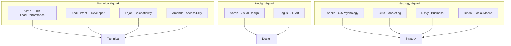

# 📊 Kolb-Main Project Insights Analysis

**Generated:** December 11, 2025  
**Scope:** Full repository analysis of `kolb-main` documentation project

---

## 🎯 Project Overview

The **Kolb-Main** repository is a comprehensive documentation and analysis project focused on reverse-engineering the award-winning **Corn Revolution** WebGL website. The goal is to extract actionable insights for building similar immersive 3D experiences for **Zenotika**.

### Repository Statistics

| Category | Count | Size |
|:---------|:-----:|:-----|
| Sprint Overviews | 4 | 60 KB total |
| Agile Planning Doc | 1 | 100 KB |
| Implementation Guide | 1 | 177 KB |
| HAR Capture | 1 | **84 MB** |
| Analysis Reports | 30 | ~12 folders |
| Validation Documents | 30 | 3 squads |
| Synthesis Documents | 6 | Consolidated |

---

## 🏗️ Architecture: Agile Squad Model

The project uses a **persona-based Agile methodology** across 4 sprints:



---

## ✅ Key Strengths

### 1. Evidence-Based Methodology
- **HAR file capture** (84 MB) provides ground-truth network data
- All claims require verification with sources
- Clear distinction between `✅ VERIFIED`, `⚠️ MODELED`, and `❌ UNVERIFIABLE`

### 2. Rigorous Verification Audit
The [DOCUMENTATION_GAPS_AUDIT.md](file:///a:/dev/kolb-main%20%281%29/kolb-main/reports/DOCUMENTATION_GAPS_AUDIT.md) shows exceptional self-awareness:

| Data Type | Status | Coverage |
|:----------|:------:|:--------:|
| Verified (definitive) | ✅ | 35% |
| Modeled/Estimated | ⚠️ | 25% |
| Unverifiable | ❌ | 25% |
| Reconstructed Examples | 📄 | 15% |

### 3. Comprehensive Tech Stack Recommendations
The [A4-03-tech-stack.md](file:///a:/dev/kolb-main%20%281%29/kolb-main/validation/technical/andi/A4-03-tech-stack.md) provides:
- Clear upgrade path from Corn Revolution stack (Three.js r102 → r160+)
- Bundle size budgets (<500 KB total JS)
- Security considerations (CSP compatibility notes)

---

## 🚨 Critical Gaps Identified

### 1. Business Metrics Invalidated
> [!CAUTION]
> The flagship metrics (**398K visitors, 420 leads**) are **UNVERIFIABLE**—Communication Arts source returns 404.

This invalidates the **1,300% ROI claim** used in multiple documents.

### 2. Runtime Performance Data Missing
| Metric | Status | Why |
|:-------|:------:|:----|
| Draw calls per frame | ❌ | Requires WebGL profiler |
| Device-specific FPS | ❌ | Requires physical testing |
| VRAM usage | ❌ | Not accessible via JavaScript |

### 3. Missing Topic Coverage
| Topic | Severity | Impact |
|:------|:--------:|:-------|
| A/B Testing History | 🔴 HIGH | Unknown if variations were tested |
| User Research | 🔴 HIGH | No actual user feedback |
| Audio/Sound Design | 🟡 MEDIUM | Site audio not analyzed |
| Error Handling | 🟡 MEDIUM | WebGL failure behavior undocumented |

---

## 💡 Strategic Insights

### 1. "Narrative Funnel" Pattern
The core finding across all squads is that Corn Revolution uses **scroll-driven storytelling** as a conversion mechanism:

```
Seed (Problem) → Growth (Solution) → Harvest (CTA)
```

This maps directly to the classic Hero's Journey—a validated UX pattern.

### 2. Design Trade-offs Are Intentional
> "Corn Revolution intentionally prioritizes experiential immersion over traditional performance/accessibility metrics"  
> — Awwwards jury commentary

This is a **documented creative decision**, validated by Site of the Year award.

### 3. Tech Stack Modernization Opportunity
| Component | Corn Rev (2020) | Target (2025) | Benefit |
|:----------|:---------------:|:-------------:|:--------|
| Three.js | r102 | r160+ | WebGPU prep, better TS support |
| GSAP | 2.1.2 | 3.12+ | 50% smaller bundle |
| Build Tool | Webpack | Vite | 10x faster HMR |

---

## 📈 Recommendations

### High Priority
1. **Replace unverified business metrics** with Ruler Analytics 2025 benchmarks (2.9-5.0% CVR)
2. **Run real device testing** via BrowserStack to get actual FPS data
3. **Document error handling strategy** for WebGL failures

### Medium Priority
1. Add competitor analysis (3-5 similar 3D B2B sites)
2. Conduct user research with 5-10 participants
3. Analyze audio design opportunities

### Low Priority
1. Investigate internationalization requirements
2. Add SEO keyword ranking analysis

---

## 📚 Key Files Reference

| Document | Purpose |
|:---------|:--------|
| [AGILE-DEVELOPMENT-SPRINT-PLANNING.md](file:///a:/dev/kolb-main%20%281%29/kolb-main/AGILE-DEVELOPMENT-SPRINT-PLANNING.md) | Master sprint planning |
| [DOCUMENTATION_GAPS_AUDIT.md](file:///a:/dev/kolb-main%20%281%29/kolb-main/reports/DOCUMENTATION_GAPS_AUDIT.md) | Critical gaps analysis |
| [VERIFICATION_STATUS_FINAL.md](file:///a:/dev/kolb-main%20%281%29/kolb-main/reports/VERIFICATION_STATUS_FINAL.md) | Verification summary |
| [A4-03-tech-stack.md](file:///a:/dev/kolb-main%20%281%29/kolb-main/validation/technical/andi/A4-03-tech-stack.md) | Technology recommendations |
| [ZENOTIKA-IMPLEMENTATION-GUIDE.md](file:///a:/dev/kolb-main%20%281%29/kolb-main/synthesis/ZENOTIKA-IMPLEMENTATION-GUIDE.md) | Implementation guide |

---

**Analysis Complete:** December 11, 2025
